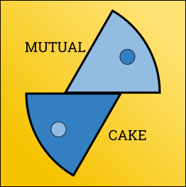

<h1 align='center'> MutualCake </h1>
An app for employees to make cakes to each other.

## 💡 Features

- Easy **sign up** form: provide name, date of birth and allergies
- **Your cakes, at glance**: who you have been assigned and what cake you've 
chosen. You can change both partner and cake, and even submit your own!
- **Your data, under your control**: View and modify your profile details, or 
delete your profile to quit the app for good.

## 🛠 Tech Stack

- Client: [Flet](https://flet.dev/)
- Server:
  - REST API: [FASTAPI](https://fastapi.tiangolo.com/)
  - Database implementation: [SQLite](https://www.sqlite.org/index.html)
  - Database handling: [SQLAlchemy](https://docs.sqlalchemy.org/)